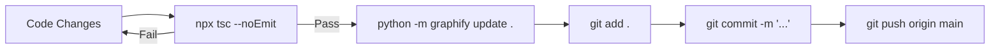

# ⚙️ Operations, CI/CD & Development Pipeline

> **Workspace**: `C:\Users\banks\ReUseChain`  
> **Platform**: E-Scrap3R AI (ReUseChain)

---

## 1. Local Setup, Build & Execution Workflow

### Step 1: Environment Verification
Ensure the following runtimes are installed on the host:
- **Node.js**: `v18.17.0+` or `v20.x` (`node -v`)
- **npm**: `v9.x` or `v10.x` (`npm -v`)
- **PowerShell**: Windows PowerShell 5.1 or PowerShell 7 (`pwsh -v`)
- **Python**: `3.10+` for knowledge graphs (`python --version`)

### Step 2: Dependency Installation
```powershell
npm install
```

### Step 3: Environment Configuration
Copy the template and verify keys in `.env`:
```powershell
# Verify .env exists or copy from .env.example
if (!(Test-Path .env)) { Copy-Item .env.example .env }
```
Required environment variables:
- `DATABASE_URL`: `"file:./prisma/dev.db"`
- `TELEGRAM_BOT_TOKEN`: Token for `@backuvro_bot` (Emergency user bot)
- `TELEGRAM_ADMIN_BOT_TOKEN`: Token for `@AHackBattle013bot` (Admin escalation bot)
- `TELEGRAM_ADMIN_CHAT_ID`: Telegram numeric chat ID for receiving alerts
- `GEMINI_API_KEY`, `OPENROUTER_API_KEY`, or `GROQ_API_KEY`: At least one active LLM key (optional: fallback heuristics operate offline)

### Step 4: Database Initialization
```powershell
# Push Prisma schema to SQLite dev.db
npx prisma db push

# Generate Prisma Client types
npx prisma generate

# (Optional) Seed standard components, parts, and baseline passports
npm run seed
```

### Step 5: Launch Development Server
```powershell
npm run dev
```
Access the application at `http://localhost:3000`.

### Step 6: Launch Telegram Bot Long-Polling Runners (Optional / Testing)
```powershell
# Runs both @backuvro_bot and @AHackBattle013bot polling services
npm run telegram:bots

# Runs standalone terminal continuous thinking agent loop
npm run agent:loop
```

---

## 2. Standard Git & Knowledge Graph Synchrony Pipeline

To ensure perfect code integrity and maintain the Graphify AST knowledge graph, adhere to this strict workflow:



### Step-by-Step Release Command Chain:
```powershell
# 1. Typecheck the entire project
npx tsc --noEmit

# 2. Update the codebase AST knowledge graph (Mandatory per rule)
python -m graphify update .

# 3. Stage changes
git add .

# 4. Commit with semantic convention
git commit -m "feat(diagnostics): add specific telemetry handler"

# 5. Push to primary remote
git push origin main
```

---

## 3. Common Terminal Commands & Diagnostic Scripts

| Command | Working Directory | Purpose |
| :--- | :--- | :--- |
| `npm run dev` | `c:\Users\banks\ReUseChain` | Starts Next.js development server on port 3000 |
| `npx tsc --noEmit` | `c:\Users\banks\ReUseChain` | Runs TypeScript compiler to verify zero type errors |
| `npx prisma db push` | `c:\Users\banks\ReUseChain` | Synchronizes SQLite database with `schema.prisma` |
| `npx prisma studio` | `c:\Users\banks\ReUseChain` | Launches visual Prisma Studio GUI on port 5555 |
| `npm run seed` | `c:\Users\banks\ReUseChain` | Seeds mock devices, parts catalog, and DPP passports |
| `npm run telegram:bots` | `c:\Users\banks\ReUseChain` | Starts real-time bidirectional Telegram polling daemon |
| `npm run agent:loop` | `c:\Users\banks\ReUseChain` | Runs the continuous CLI thinking chatbot agent |
| `python -m graphify update .` | `c:\Users\banks\ReUseChain` | Updates AST knowledge graph without LLM API costs |
| `powershell -File scripts/Collect-WindowsTelemetry.ps1` | `c:\Users\banks\ReUseChain` | Executes native Windows CIM hardware probes |
| `powershell -File scripts/ReUseChain-DesktopAgent.ps1` | `c:\Users\banks\ReUseChain` | Runs desktop background thermal anomaly monitor |
