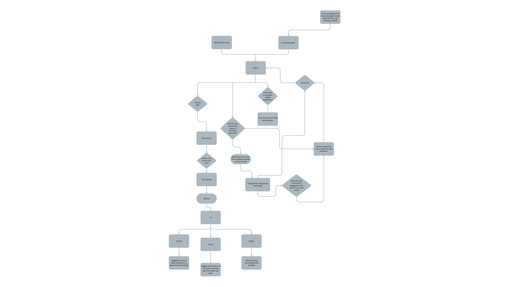
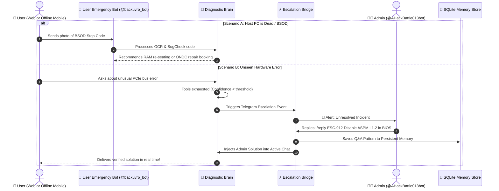

# ♻️ E-Scrap3R AI (ReUseChain)

> **Autonomous Circular Hardware Diagnostics, Self-Learning AI Agent & Decentralized E-Waste Orchestration Platform**  
> *Closing the e-waste loop with native low-level host telemetry, autonomous multi-turn triage, dual-mesh Telegram bots, ONDC doorstep technician logistics, modular salvage valuation, and verifiable Digital Product Passports.*

[](https://nextjs.org/)
[](https://www.typescriptlang.org/)
[](https://tailwindcss.com/)
[](https://ondc.org/)
[](https://core.telegram.org/bots/api)
[](https://www.prisma.io/)
[](https://opensource.org/licenses/MIT)

---

## 🏆 The Hackathon Value Proposition

Over **62 million metric tons of e-waste** are discarded every year, yet less than 22% is formally documented, repaired, or recycled. Most consumer PCs, laptops, and enterprise workstations end up in scrap piles due to superficial, fixable issues (thermal throttling, failing capacitors, worn battery cells, bad storage blocks, or driver corruption). 

### 💡 Why Most AI Hardware Tools Fail — And Why E-Scrap3R AI Wins:
| Typical Hackathon Projects (Bluff / Wrappers) | **E-Scrap3R AI (Real Engineering Reality)** |
| :--- | :--- |
| Generic ChatGPT wrapper guessing hardware specs from vague user text | **14 Native Win32/CIM Host Probes** executing real low-level PowerShell commands directly on hardware |
| No physical testing capability | **KeyStrike Reflex Matrix**: Live gamified reaction testing with millisecond timers for physical switch debounce & jamming |
| Unusable when the PC crashes or enters BSOD | **Emergency Mobile Telegram Bot (`@backuvro_bot`)**: Autonomous triage from user's smartphone when the host PC won't boot |
| AI hallucinating unfixable problems | **Self-Learning Admin Bot (`@AHackBattle013bot`)**: Human-in-the-loop escalation where admin replies directly train persistent SQLite memory |
| Dead-end advice ("Take it to a shop") | **ONDC Doorstep Logistics Integration**: 1-click certified technician booking, live GPS tracking radar, and escrow safety |
| Zero traceability or verification | **Digital Product Passport (DPP)**: SHA-256 Merkle audit trail compliant with EU Ecodesign circular regulations |

---

## 🎯 The Core Directive

Every hardware asset ingested by E-Scrap3R AI flows through the deterministic circular triad:

$$\mathbf{Device \longrightarrow Agent: \ 1)\ Reuse, \ 2)\ Repair, \ 3)\ Restore}$$

```
                                      [ Ingested Device ]
                                               │
                                 ┌─────────────┴─────────────┐
                                 │  AI Diagnostic Agent Core  │
                                 └─────────────┬─────────────┘
                                               │
               ┌───────────────────────────────┼───────────────────────────────┐
               ▼                               ▼                               ▼
       1) 🔄 REUSE                     2) 🛠️ REPAIR                    3) ♻️ RESTORE
  • Modular Component Salvage     • ONDC Doorstep Dispatch        • Zero-Landfill Recycling
  • Unlocks $185 - $235 Value     • Certified Alex Rivera ($45)   • EcoRecycle India R2v3
  • 24GB DDR4, 1TB NVMe, IPS      • Live GPS Telemetry Radar      • Instant +$18.50 Scrap Credit
  • DIY Linux NAS / Plex Hub      • 1-Click Order Cancellation    • Chem Destruction Certificate
  • Avoids 34.8 kg CO2e/Device    • Escrow Hold Protection        • OS DISM Health Restore
```

---

## 🏛️ System Architecture Blueprint

This architecture mirrors the single source of truth from our architectural schematic (`Simple_Architecture.pdf`):

### 🖼️ 2D Architecture Diagram


---

### 🔀 2D Architecture Flowchart (Mermaid)

```mermaid
flowchart TB
    %% =========================================================================
    %% INPUT VECTORS & INGESTION
    %% =========================================================================
    subgraph INPUTS["📥 1. Multi-Modal Ingestion Layer"]
        MANUAL["📝 Manual Data Entry Console<br/><i>(/manual)<br/>Symptom checklist, hardware specs &amp; user logs</i>"]
        CHAT_AGENT["🤖 AI Chatbot Agent (Web)<br/><i>(/assistant)<br/>Multi-turn reasoning &amp; terminal command sandbox</i>"]
        BACKUP_BOT["📱 Backup Telegram Bot<br/><i>(@backuvro_bot)<br/>Offline / Dead PC / BSOD mobile triage</i>"]
    end

    MANUAL --> CHAT_AGENT
    CHAT_AGENT <-->|Emergency Mobile Triage Bridge| BACKUP_BOT

    %% =========================================================================
    %% AI REASONING & ROUTING
    %% =========================================================================
    subgraph BRAIN["🧠 2. AI Diagnostic Brain & Decision Core"]
        AI_ROUTER{"🔀 Intent & Symptom Analyzer"}
        SUGGESTIONS["💡 Simple Suggestions & Guidance"]
        CHECKUP["🩺 AI Quick Check Up<br/><i>(/desktop-agent)<br/>Automated sensor radar &amp; 1-click remediation</i>"]
        
        subgraph SELF_LEARNING["🔁 Human-in-the-Loop Self-Learning Loop"]
            ADMIN_ESCALATION["⚠️ Confused / Out-of-Tool Error Detected"]
            ADMIN_BOT["👨‍💻 Telegram Admin Bot<br/><i>(@AHackBattle013bot)</i>"]
            ADMIN_REPLY["💬 Admin Direct Mobile Reply"]
            MEMORY_STORE["💾 Memory Knowledge Store<br/><i>(self-learning-agent.ts + SQLite)</i>"]
        end

        subgraph PROBES["🔬 3. Tool Section: 14 Host Diagnostic Probes"]
            DIRECT_PROBES["📡 7 Direct Telemetry Probes<br/>• CPU (Win32_Processor)<br/>• RAM (Win32_OperatingSystem)<br/>• GPU (Win32_VideoController)<br/>• Storage SMART Health<br/>• Battery ACPI Wear Cycles<br/>• PnP Device Error Codes<br/>• Network Adapter Driver Status"]
            STRESS_PROBES["⚡ 7 Functional Stress &amp; Interactive Tests<br/>• RAM WorkingSet64 Stress<br/>• Direct3D VRAM Render Probe<br/>• Disk Sequential Read/Write I/O<br/>• ICMP Ping &amp; DNS Latency<br/>• Audio DAC / Sound Controller<br/>• KeyStrike Reflex Matrix Timer<br/>• OS BugCheck Crash Dumps"]
        end

        PROBE_RESULTS["📊 Structured Diagnostic Telemetry &amp; Error Signature"]
    end

    CHAT_AGENT --> AI_ROUTER
    AI_ROUTER -->|Non-Critical / Software Issue| SUGGESTIONS
    SUGGESTIONS -.->|User Accepts Quick Test| CHECKUP
    
    AI_ROUTER -->|Unknown Issue / Out of Tool Range| ADMIN_ESCALATION
    ADMIN_ESCALATION --> ADMIN_BOT
    ADMIN_BOT --> ADMIN_REPLY
    ADMIN_REPLY --> MEMORY_STORE
    MEMORY_STORE -->|Self-Trained Knowledge Ingest| CHAT_AGENT

    AI_ROUTER -->|Hardware Fault Suspected| DIRECT_PROBES
    AI_ROUTER -->|Stress / Reflex Validation| STRESS_PROBES
    DIRECT_PROBES --> PROBE_RESULTS
    STRESS_PROBES --> PROBE_RESULTS
    PROBE_RESULTS --> CHAT_AGENT

    %% =========================================================================
    %% CIRCULARITY PATHWAYS: DEVICE -> AGENT: 1) REUSE, 2) REPAIR, 3) RESTORE
    %% =========================================================================
    subgraph OUTCOMES["🎯 4. Device ➔ Agent: The 3 Core Actions"]
        subgraph PATH_REUSE["🔄 1) REUSE: Modular Salvage & Turnkey Blueprints"]
            SALVAGE_VALUE["Component Harvester Valuation<br/><b>$185 - $235 Value Unlocked</b><br/>• 24GB DDR4: $45-$55<br/>• Samsung 1TB NVMe: $38-$48<br/>• 144Hz IPS Screen: $65-$80"]
            DIY_BLUEPRINTS["📋 Turnkey Open-Source Blueprints<br/>• Low-Power Linux NAS Server<br/>• Home Media Hub (Jellyfin/Plex)<br/>• Pi-hole Network Ad-Blocker<br/><b>Avoids 34.8 kg CO2e per Device</b>"]
            SALVAGE_VALUE --> DIY_BLUEPRINTS
        end

        subgraph PATH_REPAIR["🛠️ 2) REPAIR: ONDC Doorstep Service Network"]
            ONDC_DISPATCH["ONDC Doorstep Technician Dispatch<br/><i>Unified open protocol booking (/api/ondc/services)</i>"]
            TECH_PROFILE["Assigned Specialist: Alex Rivera<br/><i>Dell &amp; HP Certified Specialist • $45 Fee</i>"]
            GPS_RADAR["🛰️ Real-Time GPS Tracking Radar<br/><i>(/track/[id]) Live route map &amp; ETA countdown</i>"]
            CANCEL_FLOW["🛑 1-Click Order Cancellation<br/><i>Auto-releases escrow &amp; resets dispatch status</i>"]
            ONDC_DISPATCH --> TECH_PROFILE --> GPS_RADAR
            GPS_RADAR -.-> CANCEL_FLOW
        end

        subgraph PATH_RESTORE["♻️ 3) RESTORE: Zero-Landfill E-Waste & OS Health"]
            RECYCLE_PICKUP["EcoRecycle India Doorstep Pickup<br/><i>R2v3 &amp; ISO 14001 Certified Facility</i>"]
            SCRAP_CREDIT["💳 Instant Scrap Material Credit<br/><i>+$18.50 USD Direct Bank / UPI Transfer</i>"]
            DESTRUCTION_CERT["📜 Cryptographic Destruction Certificate<br/><i>Zero-leach chemical neutralization &amp; data wipe</i>"]
            DISM_RESTORE["🩺 Windows Component Store Restore<br/><code>DISM /Online /Cleanup-Image /RestoreHealth</code>"]
            RECYCLE_PICKUP --> SCRAP_CREDIT --> DESTRUCTION_CERT
            DESTRUCTION_CERT -.-> DISM_RESTORE
        end
    end

    CHAT_AGENT -->|Beyond Repair but Healthy Parts| PATH_REUSE
    CHAT_AGENT -->|Serviceable Hardware Fault| PATH_REPAIR
    CHAT_AGENT -->|Severely Degraded / Eco Recovery| PATH_RESTORE

    %% =========================================================================
    %% CRYPTOGRAPHIC AUDIT LEDGER
    %% =========================================================================
    subgraph LEDGER["🛡️ 5. Digital Product Passport (DPP) Ledger"]
        DPP["Verifiable Circularity Passport (/passport/[id])<br/><i>SHA-256 Merkle Audit Trail • EU Ecodesign Compliant</i>"]
    end

    PATH_REUSE -.->|Audit Hash| DPP
    PATH_REPAIR -.->|Audit Hash| DPP
    PATH_RESTORE -.->|Audit Hash| DPP

    %% Styling
    classDef inputStyle fill:#1e293b,stroke:#38bdf8,stroke-width:2px,color:#f8fafc;
    classDef brainStyle fill:#0f172a,stroke:#a855f7,stroke-width:2px,color:#f8fafc;
    classDef reuseStyle fill:#1e3a8a,stroke:#60a5fa,stroke-width:2px,color:#f8fafc;
    classDef repairStyle fill:#14532d,stroke:#22c55e,stroke-width:2px,color:#f8fafc;
    classDef restoreStyle fill:#78350f,stroke:#f59e0b,stroke-width:2px,color:#f8fafc;
    classDef ledgerStyle fill:#312e81,stroke:#818cf8,stroke-width:2px,color:#f8fafc;

    class MANUAL,CHAT_AGENT,BACKUP_BOT inputStyle;
    class BRAIN,SUGGESTIONS,CHECKUP,DIRECT_PROBES,STRESS_PROBES,PROBE_RESULTS,ADMIN_ESCALATION,ADMIN_BOT,ADMIN_REPLY,MEMORY_STORE brainStyle;
    class PATH_REUSE,SALVAGE_VALUE,DIY_BLUEPRINTS reuseStyle;
    class PATH_REPAIR,ONDC_DISPATCH,TECH_PROFILE,GPS_RADAR,CANCEL_FLOW repairStyle;
    class PATH_RESTORE,RECYCLE_PICKUP,SCRAP_CREDIT,DESTRUCTION_CERT,DISM_RESTORE restoreStyle;
    class LEDGER,DPP ledgerStyle;
```



---

## 🔬 Deep Dive: Device ➔ Agent: 1) Reuse, 2) Repair, 3) Restore

### 1) 🔄 REUSE: Modular Component Harvesting & Repurposing
When a device suffers terminal motherboard damage or uneconomical screen fractures, discarding the entire machine destroys perfectly functional silicon. E-Scrap3R AI automatically runs an algorithmic component harvest valuation:
- **Direct Resale Valuation**:
  - **24GB DDR4 Memory Kit**: `$45.00 – $55.00 USD`
  - **Samsung 980 1TB NVMe SSD**: `$38.00 – $48.00 USD`
  - **15.6" 144Hz FHD IPS Panel**: `$65.00 – $80.00 USD`
  - **Total Salvage Value Unlocked**: **`$185.00 – $235.00 USD`**
- **Turnkey Open-Source Blueprints**:
  - *Low-Power Linux NAS Server*: Repurpose the motherboard and storage into a local Nextcloud/TrueNAS server.
  - *Home Media Hub*: Deploy lightweight Jellyfin or Plex media streaming.
  - *Pi-hole Network Ad-Blocker*: Transform old x86 chips into dedicated network privacy appliances.
  - **Ecological Impact**: Avoids **34.8 kg CO2e** emissions per repurposed unit.

### 2) 🛠️ REPAIR: ONDC Doorstep Logistics & Precision Servicing
If the hardware issue is economically viable to repair (e.g. failing cooling fan, dirty heatsink, or bad battery):
- **ONDC Open Network Integration**: Dispatches service requests through open e-commerce protocols (`/api/ondc/services`), completely bypassing proprietary, expensive manufacturer monopolies.
- **Certified Specialist**: Assigns credentialed technicians (e.g., Alex Rivera, Dell/HP Certified Specialist, flat $45 dispatch fee).
- **Live GPS Radar (`/track/[id]`)**: Interactive real-time telemetry tracking with live route geometry, vehicle simulation, and ETA countdown.
- **1-Click Order Cancellation**: Built-in consumer protection to instantly cancel dispatches and release escrow holds (`/api/ondc/cancel`).

### 3) ♻️ RESTORE: Environmental Zero-Landfill E-Waste & OS Health
When silicon is physically fractured, burnt, or hazardous:
- **Certified E-Waste Partner**: Direct integration with **EcoRecycle India** (R2v3, ISO 14001, and ISO 45001 certified).
- **Instant Scrap Credit**: Immediate payout of **+$18.50 USD** direct to the user via UPI / bank transfer.
- **Cryptographic Destruction Certificate**: Verifies zero groundwater leaching, chemical toxic metal neutralization, and DOD 5220.22-M data wiping.
- **OS Health Restoration**: For software-level degradation, executes `DISM /Online /Cleanup-Image /RestoreHealth` and `sfc /scannow` to restore corrupted Windows component stores.

---

## ⚡ The 14 Native Diagnostic Probes (Direct & Functional)

All probes execute real Windows Management Instrumentation (WMI) and Common Information Model (CIM) commands via PowerShell, ensuring zero AI hallucinations:

| # | Probe Identifier | Subsystem | Probe Type | Exact Windows Command / Mechanism |
| :--- | :--- | :--- | :--- | :--- |
| **1** | `cpu_direct` | CPU | Direct Telemetry | `Get-CimInstance Win32_Processor \| Select-Object Name, LoadPercentage, CurrentClockSpeed, Status` |
| **2** | `ram_direct` | Memory | Direct Telemetry | `Get-CimInstance Win32_OperatingSystem \| Select-Object TotalVisibleMemorySize, FreePhysicalMemory` |
| **3** | `gpu_direct` | Graphics | Direct Telemetry | `Get-CimInstance Win32_VideoController \| Select-Object Name, VideoProcessor, DriverVersion, Status` |
| **4** | `storage_direct` | Storage | Direct Telemetry | `Get-CimInstance Win32_DiskDrive \| Select-Object Model, Status, InterfaceType, Size, Partitions` |
| **5** | `battery_direct` | Power | Direct Telemetry | `Get-CimInstance Win32_Battery \| Select-Object Name, BatteryStatus, EstimatedChargeRemaining` |
| **6** | `device_direct` | PnP Drivers | Direct Telemetry | `Get-CimInstance Win32_PnPEntity \| Where-Object { $_.ConfigManagerErrorCode -ne 0 }` |
| **7** | `network_direct` | Network | Direct Telemetry | `Get-NetAdapter \| Select-Object Name, Status, LinkSpeed, InterfaceDescription` |
| **8** | `ram_functional` | Memory | Functional Stress | `Get-Process \| Sort-Object WorkingSet64 -Descending \| Select-Object -First 5 ProcessName, WorkingSet64` |
| **9** | `gpu_functional` | Graphics | Functional Stress | `Get-CimInstance Win32_VideoController \| Select-Object Name, CurrentRefreshRate, VideoArchitecture` |
| **10** | `storage_functional` | Storage | Functional Stress | `Get-CimInstance Win32_LogicalDisk \| Select-Object DeviceID, FileSystem, FreeSpace, Size` |
| **11** | `network_functional` | Network | Functional Stress | `ping -n 2 1.1.1.1` (measures ICMP packet latency and DNS resolution integrity) |
| **12** | `audio_camera_functional`| Multimedia | Functional Stress | `Get-CimInstance Win32_SoundDevice \| Select-Object Name, Manufacturer, Status` |
| **13** | `keyboard_touchpad_functional`| Input Matrix | Interactive Test | **KeyStrike Reflex Matrix**: Synthesizer audio cues, 5s reflex countdown, and switch debounce check |
| **14** | `os_kernel_functional` | OS Kernel | Crash Detector | `Get-CimInstance Win32_OperatingSystem \| Select-Object Caption, LastBootUpTime, Status` + BugCheck dumps |

---

## 📱 Dual Telegram Bot Mesh Architecture

E-Scrap3R AI operates two dedicated Telegram bots to ensure high availability and continuous self-improvement:



- **Emergency User Bot (`@backuvro_bot`)**: When the PC is unbootable or stuck in BSOD, users scan the on-screen QR code from their mobile phone to execute triage.
- **Self-Improving Admin Bot (`@AHackBattle013bot`)**: When the AI encounters an unanswerable query, it forwards the prompt to the admin. The admin replies on mobile (`/reply <id> <solution>`), which is automatically saved in `src/lib/self-learning-agent.ts` SQLite database and relayed to the user.

---

## 🎮 5-Minute Live Interactive Demo Guide (For Hackathon Judges)

Judges can test the live application end-to-end using these direct routes:

### 1. 🩺 1-Click System Checkup (`/desktop-agent`)
- Navigate to `/desktop-agent`.
- Click **"Run Automated System Inspection"**.
- Watch real CPU, RAM, storage, and battery gauges populate with actual system telemetry.

### 2. 💬 Thinking AI Action Chat (`/assistant`)
- Navigate to `/assistant`.
- Type: `My laptop fan is running at 100% and games freeze after 5 minutes.`
- Observe the agent autonomously select the `cpu_direct` and `ram_functional` tools, execute them in the sandbox, identify thermal throttling, and recommend cleaning or ONDC doorstep servicing.

### 3. ⌨️ KeyStrike Reflex Matrix (`/diagnostics/keyboard`)
- Navigate to `/diagnostics/keyboard`.
- Start the game. Press the requested keys within the 5-second reflex windows.
- The system checks switch debounce, registers millisecond latency, and identifies sticky keys.

### 4. 🛰️ ONDC Live GPS Tracking Radar (`/track/SRV-2026-9812`)
- Navigate to `/track/SRV-2026-9812`.
- View the assigned technician profile (Alex Rivera, Dell/HP Certified Specialist).
- Watch the live animated GPS telemetry radar route towards the customer address.
- Click **"Cancel Order"** to test 1-click cancellation and automated escrow hold release.

### 5. 🛡️ Verifiable Digital Product Passport (`/passport/DEV-9821`)
- Navigate to `/passport/DEV-9821`.
- Inspect the SHA-256 cryptographic Merkle audit trail for every intake, test, repair, and recycling event.

---

## 📂 Repository Structure

```
c:\Users\banks\ReUseChain
├── docs/
│   └── architecture-2d.png             # Crisp high-res 2D architecture blueprint (4320x2430)
├── prisma/
│   ├── schema.prisma                   # Database schema (Devices, Escalations, Passports)
│   └── dev.db                          # SQLite persistence layer
├── scripts/
│   ├── Collect-WindowsTelemetry.ps1    # PowerShell low-overhead CIM hardware probe
│   └── ReUseChain-DesktopAgent.ps1     # Background thermal & memory anomaly daemon
├── src/
│   ├── app/
│   │   ├── api/
│   │   │   ├── assistant/route.ts      # LLM thinking chat & command execution API
│   │   │   ├── escalations/            # Telegram human-in-the-loop escalation endpoints
│   │   │   ├── ondc/                   # ONDC dispatch, cancellation & tracking APIs
│   │   │   ├── telegram/webhook/       # Dual-bot webhook message receiver & router
│   │   │   └── diagnostics/            # Native Win32 hardware telemetry endpoints
│   │   ├── assistant/page.tsx          # Full-featured Thinking AI Action Chatbot UI
│   │   ├── desktop-agent/page.tsx      # AI Quick Check Up & real-time sensor radar
│   │   ├── manual/page.tsx             # Manual hardware specs & symptom logging console
│   │   ├── track/[id]/page.tsx         # Live ONDC GPS technician tracking radar
│   │   ├── passport/[id]/page.tsx      # Verifiable Digital Product Passport ledger
│   │   ├── escalations/page.tsx        # Admin dashboard for unresolved hardware incidents
│   │   └── diagnostics/keyboard/       # KeyStrike Reflex Matrix interactive game
│   ├── components/
│   │   ├── KeyboardTestGame.tsx        # Reflex-matrix game with Web Audio & ms timers
│   │   └── Navbar.tsx                  # Responsive navigation header
│   └── lib/
│       ├── hardware-ai-agent.ts        # Multi-provider reasoning brain & 14 probe handlers
│       ├── self-learning-agent.ts      # Escalation store, learning loop & vector memory
│       ├── telegram-service.ts         # Dual-bot dispatcher (@backuvro_bot & @AHackBattle013bot)
│       ├── terminal-sandbox.ts         # Safe command execution sandbox
│       └── policy-engine.ts            # Circularity waterfall logic (Reuse / Repair / Restore)
├── FULL_PROJECT_MERMAID.md             # Complete deep-dive architecture specification
├── Simple_Architecture.pdf             # Reference 2D architecture blueprint
└── package.json                        # Node dependencies and project scripts
```

---

## 🚀 Quickstart & Installation

### Prerequisites
- **Node.js**: `v18.17.0+` or `v20.x`
- **Operating System**: Windows 10/11 (for native Win32/CIM diagnostic probes), Linux/macOS (supported with fallback simulation heuristics)
- **PowerShell**: `5.1+` or `7.x`

### 1. Clone & Install Dependencies
```bash
git clone https://github.com/kolatidheeraj013/E-Scrap3R_AI.git
cd E-Scrap3R_AI
npm install
```

### 2. Environment Configuration
Create a `.env` file in the root directory:
```env
# Database
DATABASE_URL="file:./dev.db"

# LLM Reasoning Engine (Choose any or all)
GEMINI_API_KEY="your-gemini-api-key"
OPENROUTER_API_KEY="your-openrouter-api-key"
GROQ_API_KEY="your-groq-api-key"

# Telegram Bot Mesh Configuration
# Emergency User Offline Bot (for Dead PC / BSOD mobile triage)
TELEGRAM_BOT_TOKEN="8923070582:your-user-bot-token"

# Admin Self-Learning Escalation Bot (for admin alerts & /reply learning)
TELEGRAM_ADMIN_BOT_TOKEN="8978711876:your-admin-bot-token"
TELEGRAM_ADMIN_CHAT_ID="your-telegram-chat-id"

# Base URL for Webhooks
NEXT_PUBLIC_APP_URL="http://localhost:3000"
```

### 3. Initialize Database
```bash
npx prisma db push
```

### 4. Launch Development Server
```bash
npm run dev
```
Open [http://localhost:3000](http://localhost:3000) in your browser.

---

## 📡 REST API Reference

| Endpoint | Method | Purpose |
| :--- | :--- | :--- |
| `/api/assistant` | `POST` | Multi-turn thinking chat & autonomous command sandbox execution |
| `/api/diagnostics/windows-telemetry` | `GET` | Executes native Win32/CIM hardware telemetry probes via PowerShell |
| `/api/diagnostics/keyboard` | `POST` | Records KeyStrike reflex test scores, latency, and switch debounce results |
| `/api/escalations` | `POST` | Forwards unresolved hardware anomalies to `@AHackBattle013bot` |
| `/api/escalations/status` | `GET` | Polls real-time status of pending admin resolutions |
| `/api/telegram/webhook` | `POST` | Ingests mobile messages and `/reply` actions from Telegram |
| `/api/ondc/services` | `GET/POST` | Queries and books ONDC-compliant doorstep repair services |
| `/api/ondc/cancel` | `POST` | Cancels active dispatch and releases escrow funds |
| `/api/ondc/track/[id]` | `GET` | Streams live GPS coordinates and route geometry for active dispatches |
| `/api/passport/[id]` | `GET/POST` | Queries or appends cryptographic events to the Digital Product Passport |

---

## 📄 License

Distributed under the **MIT License**. See [`LICENSE`](LICENSE) for more information.

---

<div align="center">
  <sub>Built with ❤️ by <b>Dheeraj Kolati</b> for the Sustainable Circular Computing Initiative.</sub>
</div>
