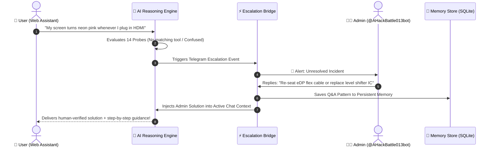

# ♻️ E-Scrap3R AI (ReUseChain)

> **Autonomous Circular Hardware Diagnostics, Self-Learning AI Agent & Decentralized E-Waste Orchestration Platform**  
> *Transforming end-of-life electronics into verified circular assets through native telemetry, autonomous triage, ONDC doorstep repair, modular salvage, and certified zero-landfill recycling.*

[](https://nextjs.org/)
[](https://www.typescriptlang.org/)
[](https://tailwindcss.com/)
[](https://ondc.org/)
[](https://core.telegram.org/bots/api)
[](https://www.prisma.io/)
[](https://opensource.org/licenses/MIT)

---

## 📌 Executive Overview

The world generates over **62 million metric tons of e-waste annually**, with less than 22% properly documented, collected, or recycled. Most consumer and enterprise hardware is discarded prematurely due to superficial component failures (e.g., thermal throttling, driver corruption, worn battery cells, or failed storage sectors) that could be repaired, repurposed, or cleanly harvested for high-value components.

**E-Scrap3R AI (ReUseChain)** is a full-stack, enterprise-grade platform designed to close the circular economy loop for computing hardware. By pairing **14 native low-level host diagnostic probes** with a **multi-provider LLM reasoning brain**, **dual-mesh Telegram bots**, **ONDC-compliant doorstep technician dispatch**, and a **verifiable Digital Product Passport (DPP)**, E-Scrap3R AI autonomously enforces the **Circularity Waterfall**:

$$\text{Repair} \longrightarrow \text{Reuse} \longrightarrow \text{Recycle}$$

---

## 🏛️ System Architecture Blueprint

Below is the architectural representation mirroring the system design blueprint (`Simple_Architecture.pdf`), illustrating the complete journey from multi-modal ingestion to the autonomous self-learning escalation loop and the 3 circularity pathways.

### 🖼️ 2D Architecture Diagram


---

### 🔀 2D Architecture Flowchart (Mermaid)

```mermaid
flowchart TB
    %% =========================================================================
    %% INPUT VECTORS & INGESTION
    %% =========================================================================
    subgraph INPUTS["📥 1. Multi-Modal Input Layer"]
        MANUAL["📝 Manual Data Entry Console<br/><i>(/manual)<br/>Symptom checklist, hardware specs &amp; user logs</i>"]
        CHAT_AGENT["🤖 AI Chatbot Agent (Web)<br/><i>(/assistant)<br/>Multi-turn reasoning &amp; terminal command sandbox</i>"]
        BACKUP_BOT["📱 Backup Telegram Bot<br/><i>(@backuvro_bot)<br/>Offline / Dead PC / BSOD mobile triage</i>"]
    end

    MANUAL --> CHAT_AGENT
    CHAT_AGENT <-->|Emergency Mobile Triage Bridge| BACKUP_BOT

    %% =========================================================================
    %% AI REASONING & ROUTING
    %% =========================================================================
    subgraph BRAIN["🧠 2. AI Diagnostic Brain & Decision Core"]
        AI_ROUTER{"🔀 Intent & Symptom Analyzer"}
        SUGGESTIONS["💡 Simple Suggestions & Guidance"]
        CHECKUP["🩺 AI Quick Check Up<br/><i>(/desktop-agent)<br/>Automated sensor radar &amp; 1-click remediation</i>"]
        
        subgraph SELF_LEARNING["🔁 Human-in-the-Loop Self-Learning Loop"]
            ADMIN_ESCALATION["⚠️ Confused / Out-of-Tool Error Detected"]
            ADMIN_BOT["👨‍💻 Telegram Admin Bot<br/><i>(@AHackBattle013bot)</i>"]
            ADMIN_REPLY["💬 Admin Direct Mobile Reply"]
            MEMORY_STORE["💾 Memory Knowledge Store<br/><i>(self-learning-agent.ts + SQLite)</i>"]
        end

        subgraph PROBES["🔬 3. Tool Section: 14 Host Diagnostic Probes"]
            DIRECT_PROBES["📡 7 Direct Telemetry Probes<br/>• CPU (Win32_Processor)<br/>• RAM (Win32_OperatingSystem)<br/>• GPU (Win32_VideoController)<br/>• Storage SMART Health<br/>• Battery ACPI Wear Cycles<br/>• PnP Device Error Codes<br/>• Network Adapter Driver Status"]
            STRESS_PROBES["⚡ 7 Functional Stress &amp; Interactive Tests<br/>• RAM WorkingSet64 Stress<br/>• Direct3D VRAM Render Probe<br/>• Disk Sequential Read/Write I/O<br/>• ICMP Ping &amp; DNS Latency<br/>• Audio DAC / Sound Controller<br/>• KeyStrike Reflex Matrix Timer<br/>• OS BugCheck Crash Dumps"]
        end

        PROBE_RESULTS["📊 Structured Diagnostic Telemetry &amp; Error Signature"]
    end

    CHAT_AGENT --> AI_ROUTER
    AI_ROUTER -->|Non-Critical / Software Issue| SUGGESTIONS
    SUGGESTIONS -.->|User Accepts Quick Test| CHECKUP
    
    AI_ROUTER -->|Unknown Issue / Out of Tool Range| ADMIN_ESCALATION
    ADMIN_ESCALATION --> ADMIN_BOT
    ADMIN_BOT --> ADMIN_REPLY
    ADMIN_REPLY --> MEMORY_STORE
    MEMORY_STORE -->|Self-Trained Knowledge Ingest| CHAT_AGENT

    AI_ROUTER -->|Hardware Fault Suspected| DIRECT_PROBES
    AI_ROUTER -->|Stress / Reflex Validation| STRESS_PROBES
    DIRECT_PROBES --> PROBE_RESULTS
    STRESS_PROBES --> PROBE_RESULTS
    PROBE_RESULTS --> CHAT_AGENT

    %% =========================================================================
    %% CIRCULARITY PATHWAYS
    %% =========================================================================
    subgraph OUTCOMES["🎯 4. The 3 Circularity Pathways"]
        subgraph PATH_REPAIR["🛠️ PATH 1: REPAIR (Service Center / Doorstep Technician)"]
            ONDC_DISPATCH["ONDC Doorstep Technician Dispatch<br/><i>Unified open protocol booking (/api/ondc/services)</i>"]
            TECH_PROFILE["Assigned Specialist: Alex Rivera<br/><i>Dell &amp; HP Certified Specialist • $45 Fee</i>"]
            GPS_RADAR["🛰️ Real-Time GPS Tracking Radar<br/><i>(/track/[id]) Live route map &amp; ETA countdown</i>"]
            CANCEL_FLOW["🛑 1-Click Order Cancellation<br/><i>Auto-releases escrow &amp; resets dispatch status</i>"]
            ONDC_DISPATCH --> TECH_PROFILE --> GPS_RADAR
            GPS_RADAR -.-> CANCEL_FLOW
        end

        subgraph PATH_REUSE["🔄 PATH 2: REUSE (Modular Salvage & DIY Blueprints)"]
            SALVAGE_VALUE["Component Harvester Evaluation<br/><b>$185 - $235 Value Unlocked</b><br/>• 24GB DDR4: $45-$55<br/>• Samsung 1TB NVMe: $38-$48<br/>• 144Hz IPS Screen: $65-$80"]
            DIY_BLUEPRINTS["📋 Turnkey Open-Source Blueprints<br/>• Low-Power Linux NAS Server<br/>• Home Media Hub (Jellyfin/Plex)<br/>• Pi-hole Network Ad-Blocker<br/><b>Avoids 34.8 kg CO2e per Device</b>"]
            SALVAGE_VALUE --> DIY_BLUEPRINTS
        end

        subgraph PATH_RECYCLE["♻️ PATH 3: RECYCLE (Certified Zero-Landfill E-Waste)"]
            RECYCLE_PICKUP["EcoRecycle India Doorstep Pickup<br/><i>R2v3 &amp; ISO 14001 Certified Facility</i>"]
            SCRAP_CREDIT["💳 Instant Scrap Material Credit<br/><i>+$18.50 USD Direct Bank / UPI Transfer</i>"]
            DESTRUCTION_CERT["📜 Cryptographic Destruction Certificate<br/><i>Zero-leach chemical neutralization &amp; data wipe</i>"]
            RECYCLE_PICKUP --> SCRAP_CREDIT --> DESTRUCTION_CERT
        end
    end

    CHAT_AGENT -->|Feasible Hardware Repair| PATH_REPAIR
    CHAT_AGENT -->|Beyond Repair but Healthy Parts| PATH_REUSE
    CHAT_AGENT -->|Severely Degraded / Hazardous| PATH_RECYCLE

    %% =========================================================================
    %% CRYPTOGRAPHIC AUDIT LEDGER
    %% =========================================================================
    subgraph LEDGER["🛡️ 5. Digital Product Passport (DPP) Ledger"]
        DPP["Verifiable Circularity Passport (/passport/[id])<br/><i>SHA-256 Merkle Audit Trail • EU Ecodesign Compliant</i>"]
    end

    PATH_REPAIR -.->|Audit Hash| DPP
    PATH_REUSE -.->|Audit Hash| DPP
    PATH_RECYCLE -.->|Audit Hash| DPP

    %% Styling
    classDef inputStyle fill:#1e293b,stroke:#38bdf8,stroke-width:2px,color:#f8fafc;
    classDef brainStyle fill:#0f172a,stroke:#a855f7,stroke-width:2px,color:#f8fafc;
    classDef repairStyle fill:#14532d,stroke:#22c55e,stroke-width:2px,color:#f8fafc;
    classDef reuseStyle fill:#1e3a8a,stroke:#60a5fa,stroke-width:2px,color:#f8fafc;
    classDef recycleStyle fill:#78350f,stroke:#f59e0b,stroke-width:2px,color:#f8fafc;
    classDef ledgerStyle fill:#312e81,stroke:#818cf8,stroke-width:2px,color:#f8fafc;

    class MANUAL,CHAT_AGENT,BACKUP_BOT inputStyle;
    class BRAIN,SUGGESTIONS,CHECKUP,DIRECT_PROBES,STRESS_PROBES,PROBE_RESULTS,ADMIN_ESCALATION,ADMIN_BOT,ADMIN_REPLY,MEMORY_STORE brainStyle;
    class PATH_REPAIR,ONDC_DISPATCH,TECH_PROFILE,GPS_RADAR,CANCEL_FLOW repairStyle;
    class PATH_REUSE,SALVAGE_VALUE,DIY_BLUEPRINTS reuseStyle;
    class PATH_RECYCLE,RECYCLE_PICKUP,SCRAP_CREDIT,DESTRUCTION_CERT recycleStyle;
    class LEDGER,DPP ledgerStyle;
```



---

## ⚡ Core Pillars & Capabilities

### 1. 🤖 Thinking AI Action Chat & Terminal Sandbox (`/assistant`)
- **Continuous Problem-Solving Loop**: Unlike typical single-turn Q&A bots, the assistant runs an active loop evaluating live symptoms, executing diagnostic tools in an isolated sandbox, and iterating until the issue is solved or escalated.
- **Natural Language Tool Orchestration**: Supports native commands (`test_keyboard`, `collect_telemetry`, `probe_hardware`, `escalate_to_admin`).
- **Autonomous Error Interception**: Automatically distinguishes between simple software issues, physical hardware degradation, and out-of-scope queries requiring human intervention.

---

### 2. 📱 Dual Telegram Bot Mesh Architecture

The platform operates two synchronized Telegram bots to guarantee 100% uptime and human-in-the-loop self-improvement:

| Bot Name | Handle / Identity | Primary Function | Workflow |
| :--- | :--- | :--- | :--- |
| **Emergency Mobile Bot** | `@backuvro_bot` | **Offline Triage for Dead PC / BSOD** | When a host machine cannot boot or display video, users scan a QR code to diagnose symptoms from their phone. The bot interfaces with the AI reasoning engine to determine PSU, motherboard, or display panel failures. |
| **Self-Improving Admin Bot** | `@AHackBattle013bot` | **Human-in-the-Loop Escalation & Learning** | When the AI encounters an unanswerable question or missing tool, it triggers `/api/escalations`, notifying human engineers on Telegram. When the admin responds (`/reply <id> <solution>`), the answer is persisted to SQLite, trained into memory, and returned to the user in real time. |

#### 🔁 Self-Learning Human-in-the-Loop Sequence


---

### 3. 🔬 14 Native Diagnostic Probes & KeyStrike Reflex Matrix

The diagnostic engine directly interfaces with Windows Win32 APIs, CIM instances, and hardware controllers to produce deterministic telemetry:

#### 📡 Part A: Direct Telemetry Probes (7 Probes)
1. **CPU Health**: `Win32_Processor` query for clock frequency, thermal throttling state, socket integrity, and load percentage.
2. **RAM Allocation**: `Win32_OperatingSystem` probe checking pagefile saturation, available physical memory, and swap faults.
3. **GPU Direct3D**: `Win32_VideoController` querying active VRAM size, driver version, and video output status.
4. **Storage SMART**: `Win32_DiskDrive` and `MSStorageDriver_FailurePredictStatus` analyzing bad sectors, read errors, and power-on hours.
5. **Battery ACPI**: `Win32_Battery` checking design capacity vs. full charge capacity, charge cycles, and health degradation.
6. **PnP Hardware Devices**: `Win32_PnPEntity` scanning Device Manager error flags (Code 10, Code 43, driver conflicts).
7. **Network Interface**: `Get-NetAdapter` inspecting physical link speed, driver power management, and packet loss.

#### ⚡ Part B: Functional Stress & Interactive Tests (7 Probes)
8. **RAM WorkingSet Stress**: Allocates and rapidly cycles memory chunks to detect transient bit-flip errors and memory leaks.
9. **GPU Render Pipeline**: Evaluates Direct3D viewport rendering latency and frame-pacing stability.
10. **Storage Sequential I/O**: Performs localized read/write bursts on `Win32_LogicalDisk` to identify drive bottlenecks.
11. **Network ICMP Ping & DNS**: Probes Cloudflare/Google DNS resolvers (`1.1.1.1` / `8.8.8.8`) to measure latency and packet drops.
12. **Audio DAC / Sound Controller**: Probes `Win32_SoundDevice` for audio codec latency and driver response.
13. **KeyStrike Reflex Matrix**: Gamified, time-bound reaction testing (5-second reflex windows) that verifies switch debounce, key jamming, and phantom inputs.
14. **Kernel Crash Dump Verifier**: Parses Windows Event Logs for recent Kernel BugCheck Stop Codes (BSODs).

---

### 4. 🎯 The 3 Circularity Pathways

Once diagnostics conclude, the platform evaluates the **Circularity Matrix**:

```
                                  [ Hardware Assessment ]
                                             │
                       ┌─────────────────────┴─────────────────────┐
               Can it be fixed?                            Is it beyond repair?
                       │                                           │
                      YES                                          NO
                       │                                           │
         ┌─────────────┴─────────────┐               ┌─────────────┴─────────────┐
   User prefers repair?     High repair cost?  Are components intact?    Hazardous / Degraded?
         │                         │                 │                         │
        YES                       NO                YES                       YES
         │                         │                 │                         │
         ▼                         ▼                 ▼                         ▼
   ┌───────────┐             ┌───────────┐     ┌───────────┐             ┌───────────┐
   │ 1. REPAIR │             │ 2. REUSE  │     │ 2. REUSE  │             │3. RECYCLE │
   └───────────┘             └───────────┘     └───────────┘             └───────────┘
```

#### 🛠️ Pathway 1: REPAIR (ONDC Doorstep Service Network)
- **Zero-Friction Booking**: Pre-populates diagnosis, parts required, and customer profile directly to ONDC-enabled service providers.
- **Assigned Specialist**: Auto-assigns certified field technicians (e.g., Alex Rivera, Dell/HP Certified Specialist).
- **Live GPS Radar (`/track/[id]`)**: Interactive real-time telemetry tracking with live vehicle route animation and ETA countdown.
- **One-Click Order Cancellation**: Transparent cancellation mechanics that instantly release escrow holds.

#### 🔄 Pathway 2: REUSE (Modular Component Salvage & Blueprints)
- **Component Harvest Valuation**:
  - **24GB DDR4 Memory**: `$45.00 - $55.00 USD`
  - **Samsung NVMe 1TB SSD**: `$38.00 - $48.00 USD`
  - **144Hz FHD IPS Panel**: `$65.00 - $80.00 USD`
  - **Total Salvage Value Unlocked**: **`$185.00 - $235.00 USD`**
- **DIY Turnkey Blueprints**:
  - *Low-Power Linux NAS Server*: Turn degraded laptops into network-attached storage.
  - *Home Media Hub*: Deploy lightweight Jellyfin or Plex media streaming.
  - *Pi-hole Ad-Blocker*: Repurpose older CPUs as dedicated network security appliances.
  - **Environmental Impact**: **Saves 34.8 kg CO2e per refurbished device**.

#### ♻️ Pathway 3: RECYCLE (Certified Zero-Landfill E-Waste Protocol)
- **Certified E-Waste Partner**: Partnered with **EcoRecycle India** (R2v3, ISO 14001, and ISO 45001 certified).
- **Instant Scrap Credit**: Immediate payout of **+$18.50 USD** direct to bank account / UPI.
- **Cryptographic Destruction Certificate**: Verifies non-recoverable mechanical shredding, zero groundwater leaching, and DOD 5220.22-M data sanitization.

---

### 5. 🛡️ Verifiable Digital Product Passport (DPP) (`/passport/[id]`)

E-Scrap3R AI implements the **EU Ecodesign & Digital Product Passport** framework:
- **Tamper-Proof Merkle Audit Trail**: Every intake, diagnostic check, repair order, and recycling event is cryptographically linked:
  $$\text{Hash}_{n} = \text{SHA-256}\left(\text{Hash}_{n-1} \parallel \text{Timestamp} \parallel \text{DeviceID} \parallel \text{Payload}\right)$$
- **Instant Certificate Export**: Downloadable and printable official verification certificates.

---

## 📂 Repository Structure

```
c:\Users\banks\ReUseChain
├── docs/
│   └── architecture-2d.png             # Crisp high-res 2D architecture blueprint
├── prisma/
│   ├── schema.prisma                   # Database models (Devices, Escalations, Passports)
│   └── dev.db                          # SQLite persistence layer
├── scripts/
│   ├── Collect-WindowsTelemetry.ps1    # PowerShell low-overhead CIM hardware probe
│   └── ReUseChain-DesktopAgent.ps1     # Background thermal & memory anomaly daemon
├── src/
│   ├── app/
│   │   ├── api/
│   │   │   ├── assistant/route.ts      # LLM thinking chat & command execution API
│   │   │   ├── escalations/            # Telegram human-in-the-loop escalation endpoints
│   │   │   ├── ondc/                   # ONDC dispatch, cancellation & tracking APIs
│   │   │   ├── telegram/webhook/       # Dual-bot webhook message receiver & router
│   │   │   └── diagnostics/            # Native Win32 hardware telemetry endpoints
│   │   ├── assistant/page.tsx          # Full-featured Thinking AI Action Chatbot UI
│   │   ├── desktop-agent/page.tsx      # AI Quick Check Up & real-time sensor radar
│   │   ├── manual/page.tsx             # Manual hardware specs & symptom logging console
│   │   ├── track/[id]/page.tsx         # Live ONDC GPS technician tracking radar
│   │   ├── passport/[id]/page.tsx      # Verifiable Digital Product Passport ledger
│   │   ├── escalations/page.tsx        # Admin dashboard for unresolved hardware incidents
│   │   └── diagnostics/keyboard/       # KeyStrike Reflex Matrix interactive game
│   ├── components/
│   │   ├── KeyboardTestGame.tsx        # Reflex-matrix game with millisecond timers
│   │   └── Navbar.tsx                  # Responsive navigation header
│   └── lib/
│       ├── hardware-ai-agent.ts        # Multi-provider reasoning brain & 14 probe handlers
│       ├── self-learning-agent.ts      # Escalation store, learning loop & vector memory
│       ├── telegram-service.ts         # Dual-bot dispatcher (@backuvro_bot & @AHackBattle013bot)
│       ├── terminal-sandbox.ts         # Safe command execution sandbox
│       └── policy-engine.ts            # Circularity waterfall logic (Repair/Reuse/Recycle)
├── FULL_PROJECT_MERMAID.md             # Complete deep-dive architecture specification
├── Simple_Architecture.pdf             # Reference 2D architecture blueprint
└── package.json                        # Node dependencies and project scripts
```

---

## 🚀 Quickstart & Installation

### Prerequisites
- **Node.js**: `v18.17.0+` or `v20.x`
- **Package Manager**: `npm`, `yarn`, or `pnpm`
- **Operating System**: Windows 10/11 (for native Win32/CIM diagnostic probes), Linux/macOS (supported with fallback simulation heuristics)
- **PowerShell**: `5.1+` or `7.x`

### 1. Clone the Repository
```bash
git clone https://github.com/kolatidheeraj013/E-Scrap3R_AI.git
cd E-Scrap3R_AI
```

### 2. Install Dependencies
```bash
npm install
```

### 3. Configure Environment Variables
Create a `.env` file in the root directory:
```env
# Database
DATABASE_URL="file:./dev.db"

# LLM Reasoning Engine (Choose any or all)
GEMINI_API_KEY="your-gemini-api-key"
OPENROUTER_API_KEY="your-openrouter-api-key"
GROQ_API_KEY="your-groq-api-key"

# Telegram Bot Mesh Configuration
# Emergency User Offline Bot (for Dead PC / BSOD mobile triage)
TELEGRAM_BOT_TOKEN="8923070582:your-user-bot-token"

# Admin Self-Learning Escalation Bot (for admin alerts & /reply learning)
TELEGRAM_ADMIN_BOT_TOKEN="8978711876:your-admin-bot-token"
TELEGRAM_ADMIN_CHAT_ID="your-telegram-chat-id"

# Base URL for Webhooks
NEXT_PUBLIC_APP_URL="http://localhost:3000"
```

### 4. Initialize Database
```bash
npx prisma db push
```

### 5. Launch the Development Server
```bash
npm run dev
```

Open [http://localhost:3000](http://localhost:3000) in your browser.

---

## 🎮 Interactive Features Walkthrough

### 1. AI Quick Check Up (`/desktop-agent`)
Visit `/desktop-agent` to run a 1-click system inspection. The dashboard executes the local PowerShell telemetry script and visualizes CPU load, memory utilization, storage SMART status, and battery health with color-coded health indicators.

### 2. Thinking AI Action Chat (`/assistant`)
Experience the loop chatbot agent. Type any symptom:
> *"My laptop fan is running at 100% and games freeze after 5 minutes."*  
The agent autonomously identifies thermal throttling, queries CPU temperatures, benchmarks memory, and offers a tailored repair or cleaning plan.

### 3. KeyStrike Reflex Matrix (`/diagnostics/keyboard`)
If you suspect keyboard switch bounce or key jamming, launch the KeyStrike Reflex test. The application presents random keystroke challenges within 5-second reflex windows, logging response latency and identifying non-responsive switch matrices.

### 4. ONDC Doorstep Tracking Radar (`/track/SRV-2026-9812`)
Simulate real-time doorstep service delivery. Watch the specialist technician navigate the GPS radar map in real time, view technician credentials, or trigger an instant cancellation with automated escrow release.

---

## 📡 API Reference Overview

| Endpoint | Method | Description |
| :--- | :--- | :--- |
| `/api/assistant` | `POST` | Send natural language prompts to the multi-provider diagnostic engine |
| `/api/diagnostics/windows-telemetry` | `GET` | Execute Win32/CIM diagnostic collector and return structured JSON |
| `/api/diagnostics/keyboard` | `POST` | Record KeyStrike reflex matrix test scores and latency metrics |
| `/api/escalations` | `POST` | Escalate unresolved hardware incidents to `@AHackBattle013bot` |
| `/api/escalations/status` | `GET` | Poll status of pending admin resolutions |
| `/api/telegram/webhook` | `POST` | Ingest incoming mobile messages and `/reply` actions from Telegram |
| `/api/ondc/services` | `GET/POST` | Search and book ONDC-compliant repair, salvage, or recycling services |
| `/api/ondc/cancel` | `POST` | Cancel active technician dispatch and refund escrow |
| `/api/ondc/track/[id]` | `GET` | Stream live GPS coordinates and ETA for active dispatches |
| `/api/passport/[id]` | `GET/POST` | Query or append events to the SHA-256 Digital Product Passport |

---

## 🤝 Contributing

We welcome contributions from circular economy researchers, systems engineers, and open-source developers!

1. Fork the Project
2. Create your Feature Branch (`git checkout -b feature/AmazingFeature`)
3. Commit your Changes (`git commit -m 'feat: Add support for Linux NVMe telemetry'`)
4. Push to the Branch (`git push origin feature/AmazingFeature`)
5. Open a Pull Request

---

## 📄 License

Distributed under the **MIT License**. See [`LICENSE`](LICENSE) for more information.

---

<div align="center">
  <sub>Built with ❤️ by <b>Dheeraj Kolati</b> for the Sustainable Circular Computing Initiative.</sub>
</div>
